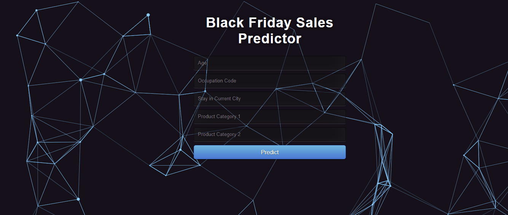
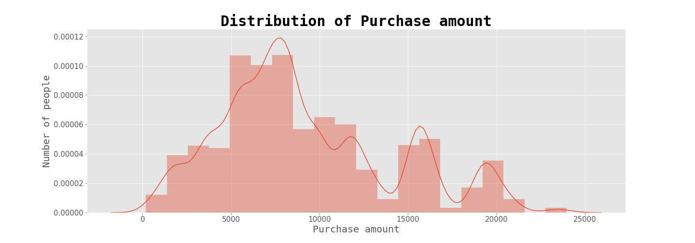

# Black Friday Sales Prediction
> Building a regression model for prediction on Black Friday Dataset

## Overview:
- In this project, we are going to predict the purchasing amount of customers during Black Friday, using various features such as age, gender, marital status.
- We will follow all the steps of a Data Science lifecycle from data collection to model deployment.

> Read More about it in my [Blogpost](https://medium.com/@adityamankar09/understanding-customers-behaviour-during-black-friday-2cc2d644d7a)

## WebApp: 
> Link: https://black-friday-sales-prediction.herokuapp.com/
----

----

## Dataset:
| Column ID |         Column Name        | Data type |           Description           | Masked |
|:---------:|:--------------------------:|:---------:|:-------------------------------:|--------|
|     0     |           User_ID          |   int64   |      Unique Id of customer      | False  |
|     1     |         Product_ID         |   object  |       Unique Id of product      | False  |
|     2     |           Gender           |   object  |         Sex of customer         | False  |
|     3     |             Age            |   object  |         Age of customer         | False  |
|     4     |         Occupation         |   int64   |   Occupation code of customer   | True   |
|     5     |        City_Category       |   object  |         City of customer        | True   |
|     6     | Stay_In_Current_City_Years |   object  | Number of years of stay in city | False  |
|     7     |       Marital_Status       |   int64   |    Marital status of customer   | False  |
|     8     |     Product_Category_1     |   int64   |       Category of product       | True   |
|     9     |     Product_Category_2     |  float64  |       Category of product       | True   |
|     10    |     Product_Category_3     |  float64  |       Category of product       | True   |
|     11    |          Purchase          |   int64   |         Purchase amount         | False  |

----

## Motivation:
- Predicting customer's behaviour is one of the most popular applications of Machine Learning in various fields like Finance, Sales, Marketing.
- Building such predictive models, we can predict the impact of the decisions taken on the growth of our organization.

## Conclusion:
- In this project, we tried to build a model using various algorithms such as Linear regression, KNN regression, Decision tree regression, Random forest and XGB regressor to get the best possible prediction.
- The hyperparameter tuned XGB regressor gives us the best rmse value and r2 score for this problem.
